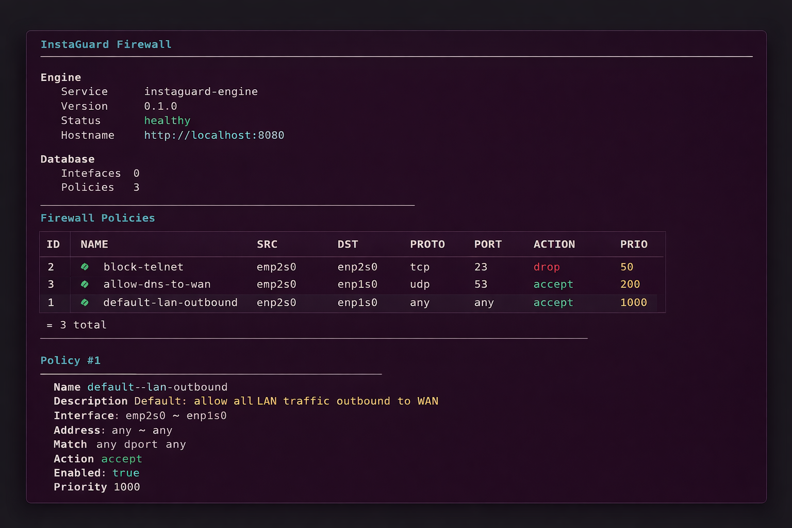

# NexappOS

The network operating system powering Nexapp's InstaRoute product line.

A FortiOS-inspired Linux-based network OS built from scratch on Debian 13,
providing the management plane, configuration database, and runtime services
for Nexapp's router/firewall products.

## Products running on NexappOS

- InstaRoute — firewall + routing + DHCP + DNS (first product)
- future: InstaSwitch, InstaWiFi

## Architecture

Admin -> CLI (nexapp) -> REST API (Go) -> SQLite -> templates -> nftables/dnsmasq -> Linux kernel

- Base OS: Debian 13 Trixie, Linux kernel 6.12 LTS
- Management daemon: nexapp-engine (Go, runs as systemd service)
- CLI tool: nexapp (Go + Cobra)
- Config database: SQLite (NexappOS CMDB)
- API: RESTful HTTP on port 8080

## Status

- [x] Milestone 1 — Base router (nftables + DHCP + DNS)
- [x] Milestone 2 — REST API + SQLite CMDB + template engine
- [x] Milestone 3 (part 1) — nexapp CLI with Cobra + tab completion
- [x] Rebranded as NexappOS with OS/product separation
- [ ] Milestone 3 (part 2) — Web UI (React dashboard)
- [ ] Milestone 4 — IPS (Suricata), VPN (WireGuard), BGP/OSPF (FRR)
- [ ] Milestone 5 — ISO packaging with Debian live-build
- [ ] Milestone 6 — NexappOS v1.0 release

## Repository layout

    nexappos/
    |-- os/
    |   |-- engine/              (nexapp-engine + nexapp Go sources)
    |   |   |-- cmd/
    |   |   |   |-- nexapp-engine/   (daemon)
    |   |   |   \-- nexapp/          (CLI)
    |   |   |-- internal/        (api, db, generators, models)
    |   |   \-- templates/       (nftables.conf.tmpl)
    |   \-- systemd/             (nexapp-engine.service)
    |-- products/
    |   \-- instaroute/          (InstaRoute product profile + configs)
    |-- docs/
    |   \-- screenshots/
    \-- scripts/

## CLI quick reference

    nexapp status                  # engine health + DB stats
    nexapp policy list             # list firewall policies
    nexapp policy show <id>        # detailed view
    nexapp policy add ...          # create new
    nexapp policy delete <id>      # remove
    nexapp apply                   # dry-run
    nexapp apply --commit          # push to kernel

## REST API endpoints

System:
- GET  /api/v1/status        engine health
- GET  /api/v1/stats         row counts

Policies:
- GET    /api/v1/policies         list
- POST   /api/v1/policies         create
- GET    /api/v1/policies/{id}    read one
- PUT    /api/v1/policies/{id}    update
- DELETE /api/v1/policies/{id}    delete

Apply:
- POST /api/v1/apply                 regenerate nftables (dry-run)
- POST /api/v1/apply?commit=true     regenerate + reload kernel

## Build from source

    cd os/engine
    go build -o bin/nexapp-engine ./cmd/nexapp-engine
    go build -o bin/nexapp        ./cmd/nexapp

## Author

Built by Raushan at Nexapp Technologies.
